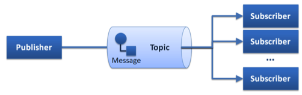
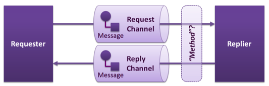

Copyright
---------
Copyright © 2013-2015 by `eProsima <http://www.eprosima.com/index.php/en/>`_, `DFKI <http://www.dfki.de/>`_, `ZHAW <http://blog.zhaw.ch/icclab>`_. All Rights Reserved

Legal Notice
------------

Please check the following `Legal Notice <http://wiki.fiware.org/FI-WARE_Open_Specification_Legal_Notice_(implicit_patents_license)>`_ to understand the rights to use these specifications.

Overview
--------

This specification describes the Advanced Middleware GE, which enables
flexible, efficient, scalable, and secure communication between
distributed applications and to/between FIWARE GEs.

Middleware in general provides a software layer between the application
and the communication network and allows application to abstract from
the intricacies of how to send a piece of data to a service offered by a
another application and possibly return results. The middleware offers
functionality to find and establish a connection to a service, negotiate
the best wire and transport protocols, access the applications data
structures and encode the necessary data in a format suitable for the
chosen protocol, and finally send that data and possibly receive results
in return. In a similar way an application can use the middleware also
to offer services to other applications by registering suitable service
functionality and interfaces, which can then be used as targets of
communication.

Basic Concepts
--------------

In this section several basic concepts of the Advanced Communication
Middleware are explained. We assume that the reader is familiar with the
basic functionality of communication middleware like CORBA or
WebServices.

Communication Patterns
~~~~~~~~~~~~~~~~~~~~~~

We can distinguish between three main different messaging patterns,
Publish/Subscribe, Point-to-Point, and Request/Reply, shown
schematically below:

   Publish/Subscribe Pattern

.. figure:: images/AdvMiddlewarePatternPoint2Point.png
   :align: center

   Point-To-Point Pattern

   Request/Reply Pattern

All available middleware technologies implement one or more of these
messaging patterns and may incorporate more advanced patterns on top of
them. Most RPC middleware is based on the Request/Reply pattern and more
recently, is extended towards support of Publish/Subscribe and/or the
Point-To-Point pattern.

W3C Web Service standards define a Request/Reply and a Publish/Subscribe
pattern which is built on top on that (WS-Notification). CORBA, in a
similar way, build its Publish/Subscribe pattern (Notification Service)
on top of a Request/Reply infrastructure. In either case the adopted
architecture is largely ruled by historical artifacts instead of
performance or functional efficiency. The adopted approach is to emulate
the Publish/Subscribe pattern on top of the more complex pattern thus
inevitably leading to poor performance and complex implementations.

The approach of the Advanced Middleware takes the other direction. It
provides native Publish/Subscribe and implements the Request/Reply
pattern on top of this infrastructure. Excellent results can be achieved
since the Publish/Subscribe is a meta-pattern, in other words a pattern
generator for Point-To-Point and Request/Reply and potential
alternatives.

Interface Definition Language (IDL)
~~~~~~~~~~~~~~~~~~~~~~~~~~~~~~~~~~~

The Advanced Middleware GE supports a novel IDL to describe the Data
Types and Operations. Following is a list of the main features it
supports:

-  **IDL, Dynamic Types & Application Types**: It support the usual
   schema of IDL compilation to generate support code for the data
   types.
-  **IDL Grammar**: An OMG-like grammar for the IDL as in DDS, Thrift,
   ZeroC ICE, CORBA, etc.
-  **Types**: Support of simple set of basic types, structs, and various
   high level types such as lists, sets, and dictionaries (maps).
-  **Type inheritance, Extensible Types, Versioning**: Advanced data
   types, extensions, and inheritance, and other advanced features will
   be supported.
-  **Annotation Language**: The IDL is extended with an annotation
   language to add properties to the data types and operations. These
   will, for example, allows adding security policies and QoS
   requirements.
-  **Security**: The IDL allows for annotating operations and data types
   though the annotation feature of our IDL, allowing setting up
   security even at the field level.

Generic Architecture
--------------------

General Note
~~~~~~~~~~~~

In contrast to other GEs, the Advanced Middleware GE is not a standalone
service running in the network, but a set of compile-/runtime tools and
a communication library to be integrated with the application.

The Advanced Middleware (AMi) architecture presented here offers a
number of key advantages over other available middleware
implementations:

-  **High-Level Service Architecture:** AMi offers applications a
   high-level architecture that can shield them from the complexities
   and dangers of network programming. When applications declare
   services and data structures they can annotate them with the QoS,
   security, and other requirements while AMi automatically implement
   them. Thus application developers can exclusively focus on the
   application functionality.
-  **Security:** The network is the main security threat to most
   applications today but existing middleware has offered only limited
   security functionality that has often been added as an afterthought
   and requires the application developer (who are often not security
   experts) to configure the security functionality. Instead, AMi offers
   *Security by Design* where security has been designed into the
   architecture from the start. Applications can simply declare their
   security needs in the form of security policies (security rules) and
   apply them to data structures and service at development time or even
   later during deployment definitions. AMi then makes sure that these
   requirements are met before any communication takes place and applies
   any suitable security measures (e.g. encryption, signatures, etc.)
   during the communication.
-  **Dynamic Multi-Protocol support:** The AMi architecture can select
   at run-time the best way to communicate with a remote service. Thus,
   an AMi application can simultaneously talk with legacy services via
   their predefined protocols (e.g. DDS). It also supports various
   communication patterns, like Publish-/Subscribe (PubSub),
   Point-To-Point, or Request-/Reply (RPC).
-  **QoS and Software Defined networking:** Where possible the QoS
   annotations are also used to configure the network using modern
   Software Defined networking functionality, e.g. to reserve bandwidth.

The Advanced Middleware GE components
~~~~~~~~~~~~~~~~~~~~~~~~~~~~~~~~~~~~~

The following layer diagram shows the main components of the Advanced
Communication Middleware GE.

.. figure:: images/I2ND-Middleware-Architecture.png
   :align: center
   :alt: I2ND Middleware Architecture Overview

   I2ND Middleware Architecture Overview

In the diagram the main communication flow goes from top to bottom for
sending data, respectively and from bottom to top for receiving data. As
in a typical layer diagram each layer is responsible for specific
features and builds on top of the layers below. Some modules are cross
cutting and go therefore over several layers (e.g. Security).

Here are some of the highlights of the AMi architecture shown in the
diagram:

-  AMi clearly separates the definition of WHAT data must be
   communicated (the communication contract via one of many interface
   definition languages (IDLs)) from WHERE that data comes from in the
   application and from HOW that data is transmitted. This *separation
   of concerns* is critical to support some advanced functionality and
   be portable to a wide range of services and their communication
   mechanisms.
-  AMi supports multiple IDLs to define what data needs to be
   communicated. On establishing the connection the interface definition
   of a service are obtained (explicitly or implicitly).
-  AMi offers annotations for QoS, security, or other features that can
   be added to the data declared by the application, to the IDL, as well
   as later during deployment. They are used by the middleware to
   automatically implement its functionality by requesting QoS
   functionality from the network layer or automatically enforcing
   security measures.
-  As the connection to a service is established, both sides choose a
   common mechanism and protocol (negotiation) to best communicate with
   each other.

The most efficient transport and protocol method supported by both sides
will be selected. AMi has been designed to also support Software Defined
Networking in order to configure QOS parameters in the network.

-  AMi offers an efficient dispatching mechanism for scheduling incoming
   request to the correct service implementation.

Below we give a short description of the different layers and
components.

API & Data Access
^^^^^^^^^^^^^^^^^

The application accesses the communication middleware using a set of
defined function calls provided by the API-layer. They may vary
depending on the communication pattern (see below).

The main functionality of the Data Access Layer is to provide the
mapping of data types and Function Stubs/Skeletons (request/response
pattern) or DataReaders/-Writers (publish/subscribe or point-to-point
pattern).

The Advanced Middleware GE provides two variants of this functionality:

-  A **basic static compile-time Data-Mapping and generation of Function
   Stubs/Skeletons or DataReaders/-Writers**, created by a compile time
   IDL-Parser/Generator from the remote service description, which is
   provided in an *Interface Definition Language (IDL)* syntax based on
   the Object Management Group (OMG) IDL (see below), which is submitted
   as a W3C draft.
-  A **dynamic runtime Data-Mapping and invocation of Function or
   DataReader/-Writer proxies**, by parsing the IDL description of the
   remote service at runtime and map it to the function/data definition
   provided by the developer when setting up the connection.

Quality of Service (QoS) parameters and Security Policies may be
provided through the API and/or IDL-Annotations. This information will
be used by the QoS and Security modules to ensure the requested
guarantees.

Depending on the communication pattern, different communication
mechanisms will be used.

-  For **publish/subscribe** and **point-to-point** scenarios, the DDS
   services and operations will be provided. When opening connections, a
   **DataWriter** for publishers/sender and a **DataReader** for
   subscribers/receivers will be created, which can be used by the
   application to send or receive DDS messages.
-  For **request/reply** scenarios the **Function Stubs/Skeletons**
   created at compile-time can be used to send or receive
   requests/replies.

Marshalling
^^^^^^^^^^^

Depending on configuration, communication pattern and type of end-points
the data will be serialized to the required transmission format when
sending and deserialized to the application data structures when
receiving.

-  **Common Data Representation (CDR)** an OMG specification used for
   all DDS/RTPS and high-speed communication.
-  **Extensible Markup Language (XML)** for WebService compatibility.
-  **JavaScript Object Notation (JSON)** for WebService compatibility.

Wire Protocols
^^^^^^^^^^^^^^

Depending on configuration, communication pattern and type of end-points
the matching Wire-Protocol will be chosen.

-  For **publish/subscribe** and **point-to-point** patterns the **Real
   Time Publish Subscribe (RTPS)** Protocol is used.
-  For **request/reply** pattern with WebService compatibility the
   **HTTP** Protocol is used.
-  For **request/reply** pattern between DDS end-points the **Real Time
   Publish Subscribe (RTPS)** Protocol is used.

Dispatching
^^^^^^^^^^^

The dispatching module is supporting various threading models and
scheduling mechanisms. The module is providing single-threaded,
multi-threaded and thread-pool operation and allows synchronous and
asynchronous operation. Priority or time constraint scheduling
mechanisms can be specified through QoS parameters.

Transport Mechanisms
^^^^^^^^^^^^^^^^^^^^

Based on the QoS parameters and the runtime-environment the **QoS
module** will decide which transport mechanisms and protocols to choose
for data transmission.

In Software Defined Networking (SDN) environments, the **QoS module**
will interface with the Netfloc GE to get additional network information
or even provision the network components to provide the requested
quality of service or privacy.

Transport Protocols
^^^^^^^^^^^^^^^^^^^

All standard transport protocols (TCP, UDP) as well as encrypted tunnels
(TLS, DTLS) are supported.

Security
^^^^^^^^

The security module is responsible for authentication of communication
partners and will ensure in the whole middleware stack, the requested
data security and privacy. The required information can be provided with
Security Annotations in the IDL and by providing a security policy via
the API.

Negotiation
^^^^^^^^^^^

The negotiation module provides mechanisms to discover or negotiate the
optimal transmission format and protocols when peers are connecting. It
discovers automatically the participants in the distributed system,
searching through the different transports available (shared memory and
UDP by default, TCP for WebService compatibility) and evaluates the
communication paradigms and and the corresponding associated QoS
parameters and security policies.

Main Interactions
-----------------

As explained above, the middleware can be used in different
communication scenarios. Depending on the scenario, the interaction
mechanisms and the set of API-functions for application developers may
vary.

API versions
~~~~~~~~~~~~

There will be two versions of APIs provided:

-  | **RPC Static API**
   | Static compile-time parsing of IDL and generation of
     Stub-/Skeletons and DataReader/DataWriter

-  | **RPC Dynamic API**
   | Dynamic runtime parsing of IDL and run-time invocation of
     operations.

Additionally following features will be provided as API extensions:

-  Advanced security policy and QoS parameters
-  Publish/subscribe functionality compatible to RPC-DDS and DDS
   applications

Classification of functions
~~~~~~~~~~~~~~~~~~~~~~~~~~~

The API-Functions can be classified in the following groups:

-  **Preparation:** statically at compile-time (Static API) or
   dynamically at run-time (Dynamic API)

   -  Declare the local applications datatypes/functions (Dynamic API
      only)
   -  Parsing the Interface Definition of the remote side (IDL-Parser)
   -  Generate Stubs-/Skeletons, DataReader-/Writer
   -  Build your application against the Stubs-/Skeletons,
      DataReader-/Writer (Static API only)

-  **Initialization:**

   -  Create the context (set up the environment, global
      QoS/Transport/Security policy,...)
   -  Open connection (provide connection specific parameters:
      QoS/Transport/Security policy, Authentication, Tunnel encryption,
      Threading policy,...)

-  **Communication**

   -  Send Message/Request/Response (sync/async, enforce security)
   -  Receive Message/Request/Response (sync/async, enforce security)
   -  Exception Handling

-  **Shutdown**

   -  Close connection (cleanup topics, subscribers, publishers)
   -  Close the context (Free resources)

Detailed description of the APIs and tools can be found in the User and
Developer Guide, which will be updated for every release of the Advanced
Middleware GE.

Basic Design Principles
-----------------------

Implementations of the Advanced Middleware GE have to comply to the
following basic design principles:

-  All modules have to provide defined and documented APIs.
-  Modules may only be accessed through these documented APIs and not
   use any internal undocumented functions of other modules.
-  Modules in the above layer model may only depend on APIs of lower
   level modules and never access APIs of higher level modules.
-  All information required by lower level modules has to be provided by
   the higher levels modules through the API or from a common
   configuration.
-  If a module provides variants of internal functionalities (e.g.
   Protocols, Authentication Mechanisms, ...) these should be
   encapsulated as Plugins with a defined interface.

